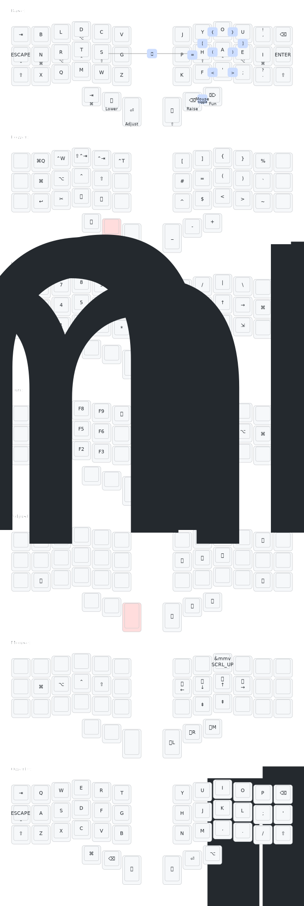

# Piantor ZMK Configuration

Personal ZMK firmware configuration for the [Piantor keyboard](https://github.com/beekeeb/piantor), a 42-key (3x6+3) split keyboard using the Raspberry Pi Pico (RP2040).

## Layout



## Features

### Gallium Columnar Staggered Layout
The default layout is based on the **Gallium** layout, optimized for comfort and efficiency on columnar staggered keyboards.

### Home Row Mods
This configuration uses **Home Row Mods** for easy access to modifiers without moving your hands from the home position:
- `A` / `S` / `D` / `F` (and mirrored on the right) act as `Shift`, `Ctrl`, `Alt`, and `GUI` when held.
- Custom `hml` and `hmr` behaviors are used to minimize misfires.

### Combos
A variety of combos are implemented for quick access to common symbols:
- `[` and `]`
- `{` and `}`
- `(` and `)`
- `<` and `>`
- `=`
- `Caps Word`
- Mouse Layer toggle

### Layers
- **Base**: Gallium layout with home row mods.
- **Lower**: Navigation, media keys, and special symbols.
- **Raise**: Numbers and symbols.
- **Fun**: Function keys (F1-F12) and print screen.
- **Adjust**: System controls (reset, bootloader) and backlight/RGB (if applicable).
- **Mouse**: Mouse movement and scrolling via ZMK Pointing.
- **Qwerty**: Standard QWERTY layout for gaming or compatibility.

## Visualization

The layout visualization is generated using [keymap-drawer](https://github.com/caksoylar/keymap-drawer).

To update the SVG after changing the keymap:
```bash
keymap parse -z config/piantor.keymap > svg/piantor.yaml
keymap draw -c svg/config.yml svg/piantor.yaml > svg/piantor.svg
```

## Configuration

- `config/piantor.keymap`: The main keymap definition.
- `config/piantor.conf`: ZMK configuration flags (e.g., enabling mouse support).
- `config/piantor.json`: Keyboard metadata and matrix definition.

## Building

This repository uses [ZMK's external modules](https://zmk.dev/docs/features/modules) to include the Piantor shield and RP2040 board support.

### GitHub Actions

The easiest way to build the firmware is to use GitHub Actions:
1. Fork this repository.
2. Enable GitHub Actions in your fork.
3. The workflow will automatically build the firmware on every push.

### Local Build

To build locally, ensure you have `west` installed and initialized:

```bash
# Initialize west if you haven't already
west init -l config
west update

# Build left half
west build -s zmk/app -b rpi_pico -- -DSHIELD=piantor_left -DZMK_CONFIG="$(pwd)/config"

# Build right half
west build -s zmk/app -b rpi_pico -- -DSHIELD=piantor_right -DZMK_CONFIG="$(pwd)/config"
```
